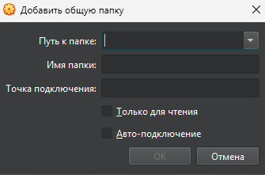
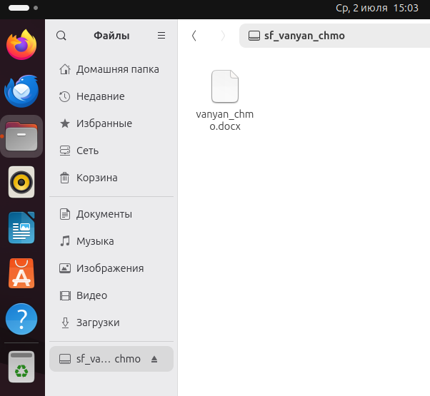

### ЕСЛИ ЗАЩИЩАТЬ РАБОТУ ВЫ БУДЕТЕ У ГРАЧА МАРТЫНОВИЧА, ТО КОМАНДА `history` ВЫВЕДЕТ АБСОЛЮТНО ВСЕ КОМАНДЫ, КОТОРЫЕ ВЫ ПИСАЛИ

### 1. Установка операционной системы, настройка и конфгурирование:
### Настроить параметры операционной системы, драйверов и служб:
  - В окне VirtualBox нажимаем на кнопку `устройства` → `подключить образ дополнений Гостевой ОС`
  - Будет подключен диск с названием `VBox_GAs_7.1.10`
  - Через проводник заходим на этот диск и нажимаем кнопку `запустить центр приложений`
  - Откроется окно подтверждения запуска, нажимаем на кнопку `запустить`
  - Ждём установку, терминал закроется автоматически (в крайнем случае попросит нажать на enter, то есть return)
  - После окончания установки обязательно перезагрузить виртуальную машину, чтоб драйвер поставился
  - Чтобы продемонстрировать установку драйвера, заходим в приложение `драйверы` и показываем, что у нас используется драйвер от VirtualBox

### ЕСЛИ У ВАС ПРИ НАЖАТИИ НА КНОПКУ `запустить` НАЧИНАЕТСЯ УСТАНОВКА И ВЫДАЁТ ОШИБКУ, ЧТО ФАЙЛ `bzip2` отсутствует, то просто открываем терминал и пишем: `sudo apt install bzip2`. ЭТО ЧАСТАЯ ОШИБКА, ПОЭТОМУ НЕ УДИВЛЯЙТЕСЬ, ЧТО ОНА МОЖЕТ ВОЗНИКНУТЬ, ЭТО НОРМА
  - Если хотите установить драйверы через терминал (это будет требовать Грач Мартынович), пишем:
```
sudo ubuntu-drivers autoinstall
---

### Настройка и установка SSH:
```
sudo apt install openssh-server -y
sudo systemctl enable ssh
sudo systemctl start ssh
sudo ufw allow ssh
```
- Проверить, включён ли SSH или нет можно командой `sudo systemctl status ssh`

---

### Настройка брандмауэра:
```
sudo ufw enable
sudo ufw allow ssh
sudo ufw status
```

---

### Настроить интернет соединение
- если будет работать ping и packetloss не будут равны 100%, то прописываем `ping ya.ru` или `ping 8.8.8.8`
- если ping работать не будет, то проверку интернет соединения делаем в установленном автоматически браузере Firefox, просто заходим в google.com
- так же можно прописывать команду `ip a`, там так же выведет данные о соединении с интернетом

---

### Выполнить установку базового программного обеспечения
- Устанавливаем в любом случае (если не установлено) пакет libreoffice, а остальное по желанию. Желательно установить 3-4 приложения
```
sudo apt install -y \
libreoffice \
curl \
wget \
git \
htop \
mc \
vim \
nano \
net-tools \
lsb-release \
unzip \
zip \
build-essential \
software-properties-common \
ca-certificates \
gnupg \
ufw
```

---

### Выполнить установку виртуального принтера
```
sudo apt install cups printer-driver-cups-pdf
```
- И на всякий случай пропишите, если вдруг у вас не появится принтер:
```
sudo systemctl enable cups
sudo systemctl start cups
```
---

### 2. Применение средств защиты компьютерных систем:
### Выполнить резервное копирование установленной операционной системы и создать установочный образ системы
- Устанавливаем timeshift для резервного копирования
```
sudo apt install timeshift -y
```
- Далее заходим в timeshift, откроется первоначальная настройка (мастер установки)
- Во вкладке выбора типа снимка выбираем `RSYNC`, жмём `далее`
- Во вкладке выбора места для снимка оставляем всё как есть, автоматически выберется диск. Если не выбрался, то выбираем ваш единственный диск и жмём `далее`
- Во вкладке выбора уровней снимка убираем галочки отовсюду
- Во вкладке домашних папок пользователей выбираем `включить все файлы` на обеих папках пользователя
- После первичной установки и настройки, откроется сама программа, где мы нажимаем на кнопку `создать` и созданием бэкапа автоматически начнётся
- После завершения бэкапа, можно посмотреть где находится бэкап, в приложении нажав `обзор`
- Если хотите сделать через терминал, то команда:
```
sudo rsync -aAXv --exclude={"/dev/*","/proc/*","/sys/*","/tmp/*","/run/*","/mnt/*","/media/*","/lost+found"} / /mnt/backup
```

---

### Создание точки восстановления системы
- Такого в линуксе нет, поэтому пункт пропускаем

---

### Создать группы пользователей, настроить права доступа
- Чтобы создать группу, пишем:
```
sudo groupadd <имя группы>
```
- Чтобы создать пользователя, пишем:
```
sudo useradd <имя пользователя>
```
- Чтобы создать пользователя и сразу добавить его в группу, пишем:
```
sudo useradd -m -G <имя группы> <имя созданной группы>
```
- Чтобы добавить уже существующего пользователя в существующую группу, пишем:
```
sudo usermod -aG (append to group) <название группы> <имя пользователя>
```
- Чтобы дать права администратора пользователю, пишем:
```
sudo usermod -aG sudo <имя пользователя>
```
- Чтобы сделать пользователя обычным, пишем:
```
sudo deluser <имя пользователя> sudo
```
- Чтобы добавить право записи для группы в папку, пишем:
```
sudo chmod g+w (для записи в папку или файл) <путь к папке /путь/к/папке>
```
- Чтобы удалить право чтения для папки, пишем:
```
sudo chmod o-r (для удаления доступа к чтению) <путь к папке /путь/к/папке>
```
- Чтобы установить для владельца права чтения, записи и выполнения (полный доступ), пишем:
```
sudo chmod u=rwx (для выдачи полных прав для чтения и записи) <путь к папке /путь/к/папке>

r: read (чтение). Владелец сможет просматривать содержимое файла.
w: write (запись). Владелец сможет изменять содержимое файла.
x: execute (выполнение). Если файл является исполняемым (например, скрипт), владелец сможет его запускать. Если это папка, то владелец сможет заходить в эту папку.
Вместе rwx означает, что мы даем владельцу-пользователю полный доступ к файлу: чтение, запись и выполнение.
```

---

### Настроить аутентификацию и авторизацию, журналов мониторинга
- Чтобы промониторить все логи, пишем:
```
sudo journalctl -xe (-x добавляет дополнительные разъяснения к некоторым сообщениям журнала, чтобы их было проще понять, -eсразу перемещает просмотр к концу журнала (самые свежие записи), чтобы вы видели последние события)
```
- Можно показать дерево процессов, пишем:
```
pstree
```

---

### Общая папка между виндовсом и линуксом
1. Выключаем виртуальную машину
2. Заходим в настройки виртуальной машины
3. Во вкладке `общие`, выбираем `дополнительно`. Общий буфер обмена и функция Drag'n'Drop должны быть в состоянии `двунаправленный`
4. Далее заходим во вкладку `сеть`. У нас уже включен `адаптер 1` с типом подключения `NAT`. Нам нужно включить `адаптер 2` и выбираем тип подключения `сетевой мост`
5. Нажимаем `ОК`, чтобы сохранились изменения
6. На рабочем столе виндовса создаём любую папку, с любым названием. Она у нас должна в будущем отобразиться на линуксе
7. Заходим обратно в настройки виртуальной машины, в раздел `общие папки`
8. Нажимаем на , откроется вот такое окно , где мы выбираем папку на рабочем столе (которую мы создавали), имя папки установится автоматом. Ставим галочку на `авто-подключение`
9. Нажимаем `ОК`, чтобы сохранить изменения с общей папкой. Запускаем машину и заходим в терминал
10. В терминале пишем:
```
sudo apt install gcc make perl
```
11. Добавление гостевой ОС мы делали при установке драйверов на первом этапе, поэтому пропускаем этот пункт (если вы устанавливали драйвер не через гостевую ОС, то всё равно придётся проделать этот путь, ибо без этого общая папка работать не будет)
12. У нас уже появилась папка в проводнике, но пока что мы не можем зайти в неё, у нас не хватает доступа. Чтобы получить доступ, пишем :
```
sudo usermod -aG vboxsf <имя пользователя>
```
13. Выдав доступ, перезагружаем виртуальную машину и заходим обратно в папку
14. После перезагрузки, запускаем проводник и заходим в папку. Если у вас там ничего нет, то папка будет так же пустая, но заходить вы в неё будете без ошибок. Если она не пустая, то будет отображён файл
- 